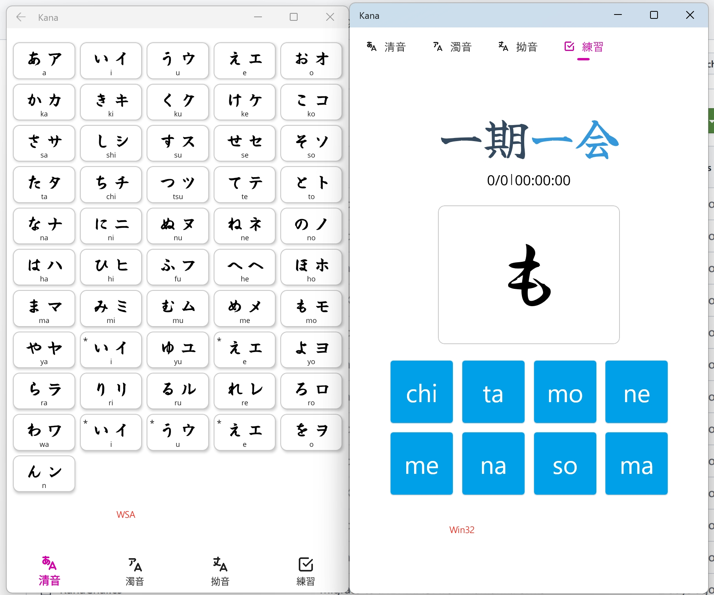

# Kana
Just 4 fun.

## Current status
- [x] Move to .NET 8 MAUI
- [x] Work on Windows
- [ ] Work on Android(Can't response click event, that's weird, still working on it)
- [ ] Work on iOS(I have no Mac to test)

## Usage
Just clone the repo and open the `kana.sln` file, then run the project.

FYI: use `dotnet publish -f net8.0-windows10.0.19041.0 -p:WindowsPackageType=None -p:SelfContained=true -p:WindowsAppSDKSelfContained=true` to compile windows exe.